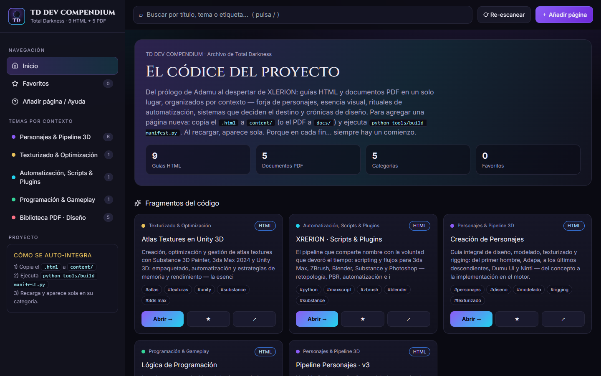
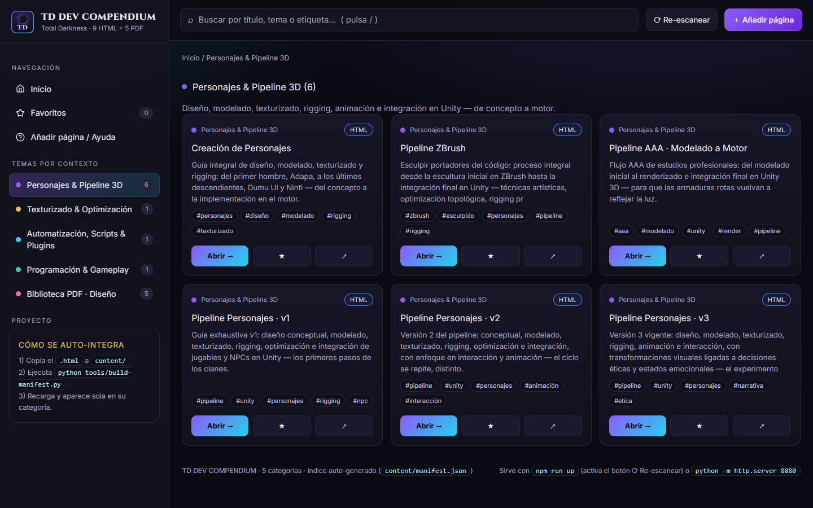
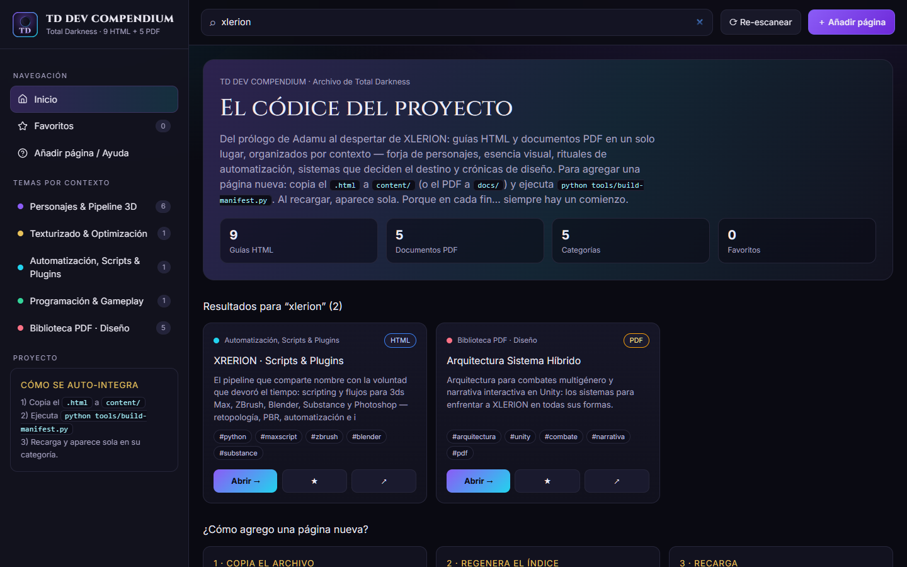
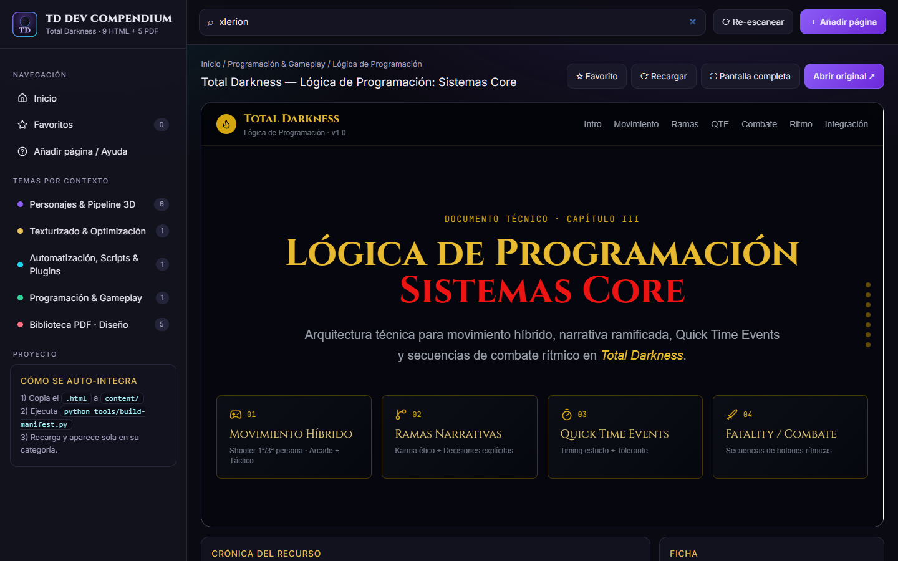
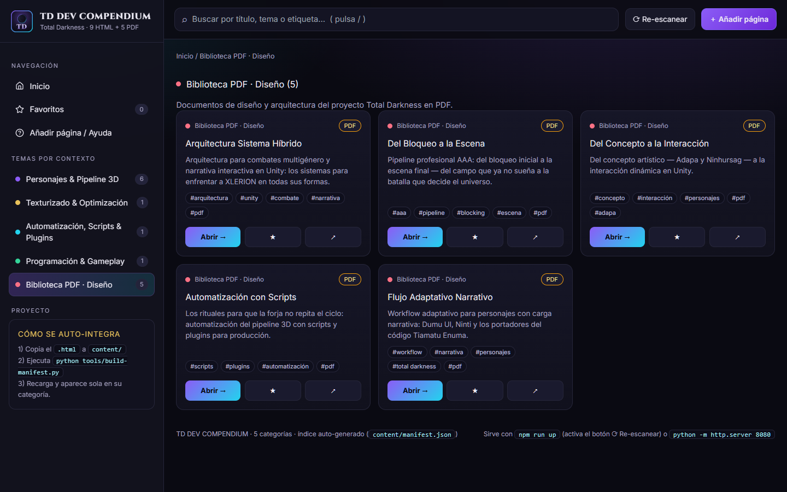

# TD Dev Compendium

> El códice del videojuego **Total Darkness** (Mike Hellawaits): guías HTML, pipelines 3D, sistemas de gameplay y crónicas de diseño — del prólogo de Adamu al despertar de XLERION. *Porque en cada fin… siempre hay un comienzo.*


## Características

- **Todo en un lugar** — 9 guías HTML + 5 PDFs organizados en 5 categorías por contexto.
- **Buscador instantáneo** (atajo `/`) por título, tema y etiquetas.
- **Visor integrado** con pantalla completa, recarga y apertura del original.
- **Favoritos y recientes** persistentes (`localStorage`).
- **Auto-integración**: copiar un `.html` a `content/` + pulsar ⟳ Re-escanear basta para publicarlo, con categoría y etiquetas detectadas.
- **Imágenes localizadas**: las 19 ilustraciones viven en `content/img/` — la plataforma funciona offline.
- **Lanzador con puertos inteligentes**: detecta puertos ocupados y sirve en el primero libre.
- **Cero dependencias de build** — solo Python 3 estándar + CDNs en ejecución.

## Inicio rápido

**Windows (recomendado):** doble clic en [`Iniciar-Plataforma.bat`](Iniciar-Plataforma.bat).

**Terminal:**

```bash
git clone https://github.com/miguelxlerion/TD-_Dev_Compendium.git
cd TD-_Dev_Compendium
npm run up          # o: python tools/launcher.py
```

Abre `http://127.0.0.1:8080` (o el puerto libre que indique el lanzador).

> Abrir `index.html` con doble clic también funciona (modo lectura con índice
> embebido), pero el botón ⟳ Re-escanear requiere el servidor: el navegador
> bloquea esas peticiones en `file://` por CORS. La propia página lo avisa.

## Capturas

| Portada | Categoría por contexto |
|---|---|
|  |  |

| Buscador | Visor de guía |
|---|---|
|  |  |

| Biblioteca PDF |
|---|
|  |

## Contenido por contexto

| Categoría | Recursos |
|---|---|
| Personajes & Pipeline 3D | Forja de los portadores del código: Adapa, Ninhursag, clanes, ZBrush, AAA |
| Texturizado & Optimización | Esencia visual: Atlas Textures (Substance, 3ds Max, Unity) |
| Automatización, Scripts & Plugins | Rituales XRERION (Python, MAXScript, Blender, UXP) |
| Programación & Gameplay | Sistemas que deciden el destino: Gen Final, karma, QTE, fatality |
| Biblioteca PDF · Diseño | Crónicas de Mike Hellawaits: del prólogo de Adamu a Red Tormenthor |

## Estructura del proyecto

```text
index.html                  # Plataforma (menú + buscador + visor + PWA básica)
site.webmanifest            # Manifiesto instalable
assets/
  css/platform.css          # Tema oscuro Total Darkness
  js/platform.js            # App: lee content/manifest.json y renderiza
  img/                      # Icono + favicon (SVG maestro, PNG 16–512, .ico)
content/
  *.html                    # Guías (nombres normalizados, sin espacios)
  img/<pagina>/             # Ilustraciones localizadas por guía
  manifest.json             # Índice auto-generado — fuente de verdad
docs/                       # PDFs de diseño
tools/
  launcher.py               # Lanzador: puerto libre + servidor + navegador
  server.py                 # Servidor local + POST /api/regenerar
  build-manifest.py         # Generador del índice (título, categoría, tags)
  localizar-imagenes.py     # Localiza imágenes remotas a content/img/
package.json                # Scripts npm (sin dependencias de build)
Iniciar-Plataforma.bat      # Lanzador con doble clic para Windows
```

> Los `.html`/`.pdf` originales (con espacios en el nombre) se conservan en la
> raíz como respaldo histórico; la plataforma usa las copias normalizadas.

## Añadir una página nueva

1. Copia `mi-guia.html` en `content/` (PDFs en `docs/`). Sin espacios ni tildes.
2. Pulsa **⟳ Re-escanear** (o `npm run manifest` por terminal).
3. Si trae imágenes remotas: `npm run imagenes` para fijarlas en local.
4. Listo — aparece sola con título, descripción, categoría y etiquetas.

Las ediciones manuales de `content/manifest.json` (badges, `featured`, categorías
corregidas) se respetan en regeneraciones futuras.

## Scripts

| Comando | Qué hace |
|---|---|
| `npm run up` | Lanza todo (puerto libre + navegador) |
| `npm run manifest` | Regenera el índice |
| `npm run imagenes` | Localiza imágenes remotas |
| `python tools/server.py [puerto]` | Solo el servidor |
| `python tools/launcher.py [--port P] [--no-browser]` | Lanzador avanzado |

## Stack

- Frontend: HTML + CSS propio, Tailwind CDN, Lucide, Cinzel/Inter.
- Guías: AOS, Alpine.js, Preline, Chart.js y Mermaid (según cada una).
- Tooling: Python 3 stdlib (sin dependencias).

## Solución de problemas

| Síntoma | Causa y arreglo |
|---|---|
| ⟳ Re-escanear no hace nada / error CORS | Abriste `index.html` como archivo: usa `Iniciar-Plataforma.bat` |
| Puerto 8080 ocupado | El lanzador usa el siguiente libre automáticamente |
| Imágenes rotas en guía nueva | Ejecuta `npm run imagenes` (las URLs firmadas caducan) |
| Página nueva no aparece | Nombre sin espacios + regenerar índice + recarga forzada (Ctrl+F5) |

## Licencia

Documentación interna del proyecto **Total Darkness**. Todos los derechos reservados.
